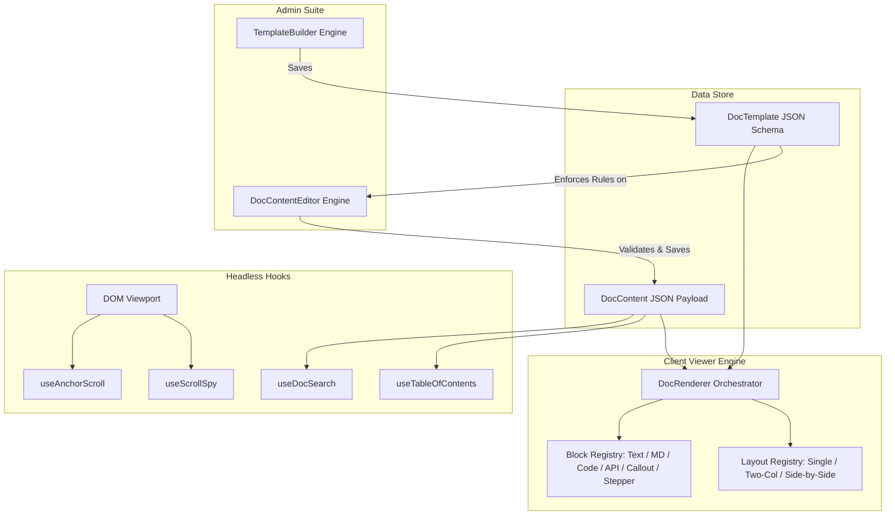

# @racinmk/doc-sdk

[](#)
[](https://www.typescriptlang.org/)
[](https://react.dev/)
[](https://zod.dev/)
[](#testing)
[](LICENSE)

A decoupled, schema-driven documentation engine and SDK for modern React and TypeScript web applications. 

`@racinmk/doc-sdk` cleanly separates documentation into three independent layers:
1. **JSON Schema Core Contracts**: Strict compile-time TypeScript types and runtime Zod validation.
2. **Admin Suite**: Visual **Template Builder** for layout/section architecture and a dynamic **Content Form Editor** for content authors.
3. **Client Viewer Engine**: Flexible `<DocRenderer />` supporting responsive layouts, extensible block registries, syntax highlighting, and headless navigation hooks.

---

## 🌟 Key Features

- 🏗️ **Three-Layer Decoupled Architecture**: Templates, document contents, and visual renderers are completely isolated.
- 🛠️ **Visual Template Builder**: Construct documentation schemas with layout presets, metadata schemas, allowed block restrictions, and live JSON schema import/export.
- ✍️ **Dynamic Content Editor**: Auto-generates form controls from template metadata definitions, with block injection, drag/ordering, duplicate, and deletion actions.
- 👁️ **Multi-Layout Viewer Engine**:
  - `two-column`: Standard documentation layout with left navigation, central content, and right sticky table of contents.
  - `single-column`: Streamlined linear layout ideal for tutorials, guides, and walkthroughs.
  - `side-by-side-code`: Stripe/Mintlify-style API layout with sticky payloads and request/response samples.
- 🧩 **Built-in Rich Blocks**:
  - `text`: Headings, lead paragraphs, captions, and body prose.
  - `markdown`: Full Markdown support with GitHub-flavored markdown rendering.
  - `code_sample`: Syntax-highlighted code snippets with line numbers and copy-to-clipboard.
  - `api_endpoint`: HTTP method badge, route path, parameter tables, and formatted JSON response bodies.
  - `callout`: Alert notifications (`info`, `warning`, `tip`, `danger`).
  - `stepper`: Interactive step-by-step progress cards.
- ⚡ **Headless Hooks Suite**:
  - `useTableOfContents`: Extracts hierarchical headings from document blocks with slugified IDs.
  - `useScrollSpy`: Tracks active headings on page scroll using `IntersectionObserver`.
  - `useDocSearch`: In-memory multi-block full-text search indexer with relevance scoring.
  - `useAnchorScroll`: Smooth deep-link anchor navigation with sticky header offset compensation.
- 🎨 **CSS Token Architecture**: Zero heavy CSS framework dependencies. Customizable via `--doc-sdk-*` CSS variables with built-in dark mode aesthetics.

---

## 🏛️ Architecture Overview



---

## 📦 Installation

```bash
npm install @racinmk/doc-sdk react react-dom
# or
pnpm add @racinmk/doc-sdk react react-dom
# or
yarn add @racinmk/doc-sdk react react-dom
```

Import the stylesheet in your application entry point:

```typescript
import '@racinmk/doc-sdk/styles.css';
```

---

## 🚀 Quickstart

### 1. Client Document Viewer

Render any document using `<DocRenderer />`:

```tsx
import React from 'react';
import { DocRenderer } from '@racinmk/doc-sdk/client';
import '@racinmk/doc-sdk/styles.css';

// Templates and content can be fetched from your API / CMS
import { mockApiReferenceTemplate, mockApiReferenceContent } from '@racinmk/doc-sdk/core';

export function DocumentationPage() {
  return (
    <DocRenderer
      template={mockApiReferenceTemplate}
      content={mockApiReferenceContent}
      onAnchorClick={(anchor) => {
        const el = document.getElementById(anchor);
        el?.scrollIntoView({ behavior: 'smooth' });
      }}
    />
  );
}
```

---

### 2. Admin Content Form Editor

Provide a dynamic authoring interface for content writers:

```tsx
import React, { useState } from 'react';
import { DocContentEditor } from '@racinmk/doc-sdk/admin';
import type { DocTemplate, DocContent } from '@racinmk/doc-sdk/core';

export function EditorPage({ template }: { template: DocTemplate }) {
  const [content, setContent] = useState<DocContent>({
    id: 'doc-new-guide',
    templateId: template.id,
    metadata: { title: 'My New Guide' },
    sections: [],
  });

  return (
    <DocContentEditor
      template={template}
      initialContent={content}
      onChange={(updated) => setContent(updated)}
      onSave={async (saved) => {
        await fetch('/api/documents', {
          method: 'POST',
          headers: { 'Content-Type': 'application/json' },
          body: JSON.stringify(saved),
        });
      }}
    />
  );
}
```

---

### 3. Admin Template Builder

Allow administrators to define layouts and section rules:

```tsx
import React, { useState } from 'react';
import { TemplateBuilder } from '@racinmk/doc-sdk/admin';
import type { DocTemplate } from '@racinmk/doc-sdk/core';

export function TemplateBuilderPage() {
  const [template, setTemplate] = useState<DocTemplate>({
    id: 'custom-api-template',
    name: 'Standard API Template',
    layoutType: 'two-column',
    metadataFields: [
      { id: 'title', name: 'Title', type: 'string', required: true },
      { id: 'version', name: 'Version', type: 'string', required: false },
    ],
    sections: [
      {
        id: 'overview',
        title: 'Overview',
        allowedBlocks: ['markdown', 'callout'],
      },
      {
        id: 'endpoints',
        title: 'API Endpoints',
        allowedBlocks: ['api_endpoint', 'code_sample'],
      },
    ],
  });

  return (
    <TemplateBuilder
      initialTemplate={template}
      onChange={(updated) => setTemplate(updated)}
      onSave={async (saved) => {
        await fetch('/api/templates', {
          method: 'POST',
          headers: { 'Content-Type': 'application/json' },
          body: JSON.stringify(saved),
        });
      }}
    />
  );
}
```

---

### 4. Custom Block Extension

Extend or override block renderers using `customBlocks`:

```tsx
import React from 'react';
import { DocRenderer, defaultBlockRegistry } from '@racinmk/doc-sdk/client';
import type { BlockRegistry, BlockProps } from '@racinmk/doc-sdk/client';

const CustomBadgeBlock: React.FC<BlockProps> = ({ block }) => {
  const data = block.data as { label?: string };
  return (
    <div style={{ padding: '1rem', background: '#4f46e5', color: '#fff', borderRadius: '8px' }}>
      Badge: {data.label}
    </div>
  );
};

const customRegistry: BlockRegistry = {
  ...defaultBlockRegistry,
  custom_badge: CustomBadgeBlock,
};

export function CustomViewer({ template, content }) {
  return (
    <DocRenderer
      template={template}
      content={content}
      customBlocks={customRegistry}
    />
  );
}
```

---

### 5. 🌗 Theming, Dark Mode & Custom Brand Colors

`@racinmk/doc-sdk` provides first-class light and dark modes with support for custom color palettes directly via component props. Both `<DocRenderer>`, `<TemplateBuilder>`, and `<DocContentEditor>` accept theme controls:

#### Mode Selection (`light` | `dark` | `system`)

```tsx
// Force dark mode
<DocRenderer template={template} content={content} theme="dark" />

// Force light mode
<DocRenderer template={template} content={content} theme="light" />

// Automatically respond to system OS preference (prefers-color-scheme)
<DocRenderer template={template} content={content} theme="system" />
```

#### Custom Brand Palettes (`lightColors` and `darkColors`)

Pass custom brand colors directly into the SDK without needing external CSS rules:

```tsx
<DocRenderer
  template={template}
  content={content}
  theme="dark"
  darkColors={{
    bg: '#0f172a',
    surface: '#1e293b',
    surfaceSubtle: '#334155',
    border: '#334155',
    text: '#f8fafc',
    textMuted: '#94a3b8',
    primary: '#6366f1',
    primaryHover: '#4f46e5',
    primaryLight: 'rgba(99, 102, 241, 0.15)',
    accent: '#38bdf8',
  }}
  lightColors={{
    bg: '#ffffff',
    surface: '#f8fafc',
    surfaceSubtle: '#f1f5f9',
    border: '#e2e8f0',
    text: '#0f172a',
    textMuted: '#64748b',
    primary: '#4f46e5',
    primaryHover: '#4338ca',
    primaryLight: '#eef2ff',
    accent: '#0284c7',
  }}
/>
```

#### Centralized `themeConfig`

Alternatively, configure mode and both color palettes in a single object:

```tsx
<DocRenderer
  template={template}
  content={content}
  themeConfig={{
    mode: 'system',
    lightColors: { primary: '#2563eb' },
    darkColors: { primary: '#60a5fa' },
  }}
/>
```

---


### 6. In-Memory Search & TOC Hooks

Implement custom navigation and search interfaces with headless hooks:

```tsx
import { useDocSearch, useTableOfContents } from '@racinmk/doc-sdk/hooks';
import type { DocContent } from '@racinmk/doc-sdk/core';

export function DocNavigation({ content }: { content: DocContent }) {
  // 1. Table of Contents
  const toc = useTableOfContents(content);

  // 2. Full-text search
  const { search, totalIndexed } = useDocSearch(content);
  const searchResults = search('authentication');

  return (
    <div>
      <p>Indexed {totalIndexed} items</p>
      <ul>
        {toc.map((item) => (
          <li key={item.id} style={{ marginLeft: `${(item.level - 1) * 12}px` }}>
            <a href={`#${item.id}`}>{item.title}</a>
          </li>
        ))}
      </ul>
    </div>
  );
}
```

---

## 🛠️ Interactive Demo Playground

`@racinmk/doc-sdk` includes an interactive playground web app showcasing all 3 tabs (Builder, Editor, and Viewer) in real time:

```bash
npm run dev
```

Visit `http://localhost:3000` to:
- Switch between pre-configured presets (API Reference, Walkthrough, Side-by-Side Code).
- Edit schemas in the **Template Builder** and watch the **Content Editor** adapt.
- Edit content blocks and test real-time rendering and in-memory search in the **Client Viewer**.

---

## 🧪 Testing & Verification

The test harness uses **Vitest** with JSDOM and `@testing-library/react`:

```bash
# Run all 52 unit and integration tests
npm test

# Run tests by category
npm run test:core         # Core contracts, schemas & validation
npm run test:blocks       # UI block primitives
npm run test:builder      # Admin TemplateBuilder engine
npm run test:editor       # Admin ContentEditor engine
npm run test:client       # Client DocRenderer & layouts
npm run test:hooks        # Headless hooks suite
npm run test:integration  # End-to-end workflow test

# Strict TypeScript typechecking
npm run typecheck

# Full production build
npm run build
```

---

## 📂 Project Structure

```text
doc-sdk/
├── core/                  # JSON Schemas, TypeScript contracts, validation & fixtures
│   ├── types.ts
│   ├── schemas.ts
│   ├── validation.ts
│   ├── registry.ts
│   └── fixtures/
├── admin/                 # Admin authoring components
│   ├── TemplateBuilder/   # Visual template designer & schema modal
│   └── ContentEditor/     # Dynamic form authoring engine & block editors
├── client/                # Client viewer engine
│   ├── blocks/            # 6 Block primitives (Text, MD, Code, API, Callout, Stepper)
│   ├── layouts/           # 3 Responsive layouts (Single, Two-Col, Side-by-Side)
│   ├── DocRenderer/       # Top-level orchestrator & BlockRenderer
│   └── styles/            # CSS tokens & doc-sdk.css
├── hooks/                 # Headless navigation & search hooks
│   ├── useTableOfContents.ts
│   ├── useScrollSpy.ts
│   ├── useDocSearch.ts
│   └── useAnchorScroll.ts
├── playground/            # Interactive Vite demo playground app
├── tests/                 # 52 unit, harness, and integration tests
├── plans/                 # Architecture specifications & master checklist
└── tsup.config.ts         # Multi-entry bundle configuration
```

---

## 📄 License

MIT © [mkr-29](https://github.com/mkr-29)
